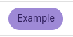

# color-contrast
A python library to calculate and modulate color contrasts according to WCAG2.1


## Usage

Install `color-contrast` into your python environment, using:

```shell
pip install color-contrast
```

After installing, you can use the project as follows:

```python

from colour import Color

from color_contrast import AccessibilityLevel, check_contrast

bg = Color("#123456")

check_contrast("#404040", bg, level=AccessibilityLevel.AA18)  # True

check_contrast("#404040", bg, level=AccessibilityLevel.AA)  # False

check_contrast("white", bg, level=AccessibilityLevel.AAA)  # True

check_contrast(Color(hsl=(1, 1, 1)), bg)  # True
```

Or if you want to modulate the colors automatically:

```python
from color_contrast import modulate, ModulationMode

modulate("5d3eb2", "5d3eb2", mode=ModulationMode.BOTH)
# Returns:
# <Color: #32215f>, <Color: #9e89d6>, true
```

This example used the same foreground and background color, this is the before and after:




## Contributing

To set the development environment up, follow the following steps.
Make sure you have poetry installed.

```shell
# Clone the repository
git clone git@github.com:ZugBahnHof/color-contrast.git

cd color-contrast

# Activate the virtual environment
poetry shell

# Install the requirements
poetry install

# Activate the commit hooks
pre-commit install 
```

Useful commands:

```shell
# Run the linter
ruff check

# Reformat
ruff check --fix
ruff format

# Run the test cases
python -m unittest tests
```
